# Base Graphics

One of the greatest strengths of R, relative to other programming languages, is the ease with which we can create publication-quality graphics. In this lesson, you'll learn about **base graphics** in R.

We do not cover the more advanced portions of graphics in $R$ in this lesson. These include **`lattic`e**, **`ggplot2`** and **`ggvis`**.

There is a school of thought that this approach is backwards, that we should teach `ggplot2` first. See [this article](http://varianceexplained.org/r/teach_ggplot2_to_beginners/) for an outline of this view.

## Introduction with Simple Data Frames

To fix ideas, we will work with simple data frames. Our main goal is to introduce various plotting functions and their arguments. All the output would look more interesting with larger, more complex data sets.

### The `cars` Dataset

Load the included data frame $cars$ with `data(cars)`.

```R
> data(cars)
```

Pull up the help page for $cars$.

```R
> help(cars)
```

As you can see in the help page, the $cars$ data set has only two variables: **speed** and **stopping distance**. Note that the data is from the $1920$s.

Run `head()` on the $cars$ data.

```R
> head(cars)
  speed dist
1     4    2
2     4   10
3     7    4
4     7   22
5     8   16
6     9   10
```

Before plotting, it is always a good idea to get a sense of the data. Key $R$ commands for doing so include, `dim()`, `names()`, `head()`, `tail()` and `summary()`.

## Basic Plotting with `plot()`

Run the `plot()` command on the $cars$ data frame.

```R
> plot(cars)
```


As always, $R$ tries very hard to give you something sensible given the information that you have provided to it. First, $R$ notes that the data frame you have given it has just two columns, so it assumes that you want to plot one column versus the other.

Second, since we do not provide labels for either axis, $R$ uses the names of the columns. Third, it creates axis tick marks at nice round numbers and labels them accordingly. Fourth, it uses the other defaults supplied in `plot()`.

We will now spend some time exploring `plot`, but many of the topics covered here will apply to most other $R$ graphics functions. Note that **'plot' is short for scatterplot**.

Look up the help page for `plot()`.

```R
> ?plot
```

### Specifying $x$ and $y$ Arguments

The help page for `plot()` highlights the different arguments that the function can take. The two most important are $x$ and $y$, the variables that will be plotted. For the next set of questions, include the argument names in your answers. That is, do not type `plot(cars$speed, cars$dist)`, although that will work. Instead, use `plot(x = cars$speed, y = cars$dist)`.

Use `plot()` command to show $speed$ on the $x$-axis and $dist$ on the $y$-axis from the $cars$ data frame. Use the form of the plot command in which vectors are explicitly passed in as arguments for $x$ and $y$.

```R
> plot(x = cars$speed, y = cars$dist)
```


Note that this produces a slightly different answer than `plot(cars)`. In this case, $R$ is not sure what you want to use as the labels on the axes, so it just uses the arguments which you pass in, data frame name and dollar signs included.

Note that there are other ways to call the plot command, i.e., using the **"formula" interface**. For example, we get a similar plot to the above with `plot(dist ~ speed, cars)`. However, we will wait till later in the lesson before using the formula interface.

Use `plot()` command to show $dist$ on the $x$-axis and $speed$ on the $y$-axis from the $cars$ data frame. This is the opposite of what we did above.

```R
> plot(x = cars$dist, y = cars$speed)
```

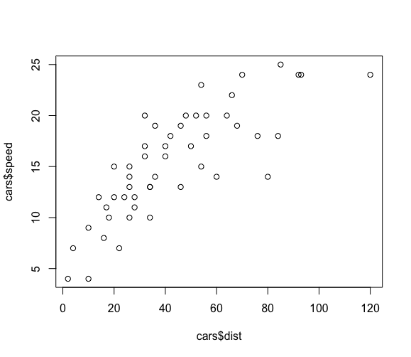

It probably makes more sense for $speed$ to go on the $x$-axis since stopping distance is a function of speed more than the other way around. So, for the rest of the questions in this portion of the lesson, always assign the arguments accordingly.

In fact, you can assume that the answers to the next few questions are all of the form `plot(x = cars$speed, y = cars$dist, ...)` but with various arguments used in place of the `...`

### Adding Axis Labels

Recreate the plot with the label of the $x$-axis set to "Speed".

```R
> plot(x = cars$speed, y = cars$dist, xlab = "Speed")
```

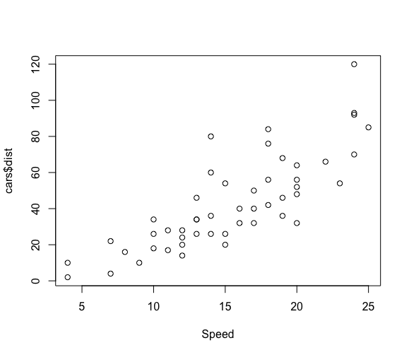

Recreate the plot with the label of the $y$-axis set to "Stopping Distance".

```R
> plot(x = cars$speed, y = cars$dist, ylab = "Stopping Distance")
```

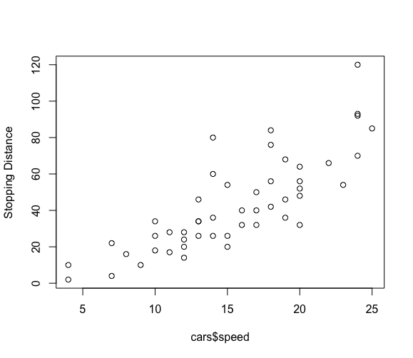

Recreate the plot with "Speed" and "Stopping Distance" as axis labels.

```R
> plot(x = cars$speed, y = cars$dist, xlab = "Speed", ylab = "Stopping Distance")
```

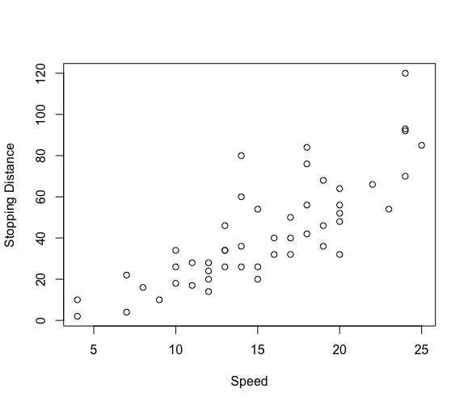

### Simplified Plot Syntax

The reason that `plots(cars)` worked at the beginning of the lesson was that $R$ was smart enough to know that the first element (i.e., the first column) in $cars$ should be assigned to the $x$ argument and the second element to the $y$ argument. To save on typing, the next set of answers will all be of the form, `plot(cars, ...)` with various arguments added.

For each question, we will only want one additional argument at a time. Of course, you can pass in more than one argument when doing a real project.

### Adding Titles

Plot $cars$ with a main title of "My Plot". Note that the argument for the main title is `"main"` not `"title"`.

```R
> plot(cars, main = "My Plot")
```

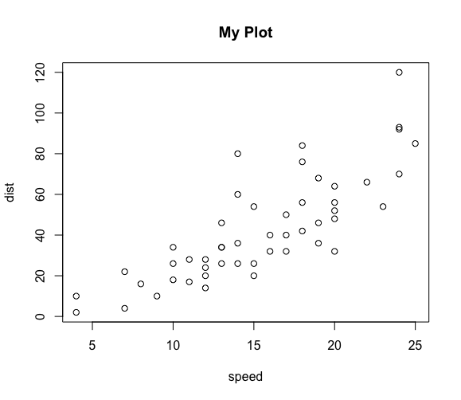

Plot $cars$ with a sub title of "My Plot Subtitle".

```R
> plot(cars, sub = "My Plot Subtitle")
```

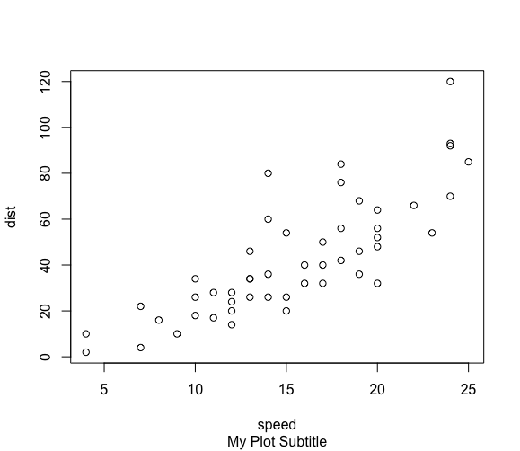

### Additional Plot Parameters

The plot help page (`?plot`) only covers a small number of the many arguments that can be passed in to `plot()` and to other graphical functions. To begin to explore the many other options, look at `?par`. Let's look at some of the more commonly used ones. Continue using `plot(cars, ...)` as the base answer to these questions.

#### Color

Plot $cars$ so that the plotted points are colored red. (Use `col = 2` to achieve this effect.)

```R
> plot(cars, col = 2)
```

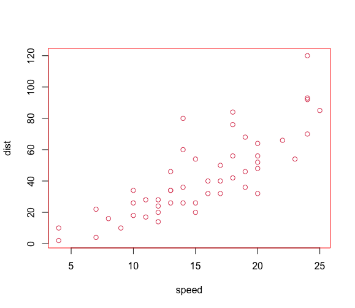

#### Axis Limits

Plot $cars$ while limiting the $x$-axis to $10$ through $15$. (Use `xlim = c(10, 15)` to achieve this effect.)

```R
> plot(cars, xlim = c(10, 15))
```

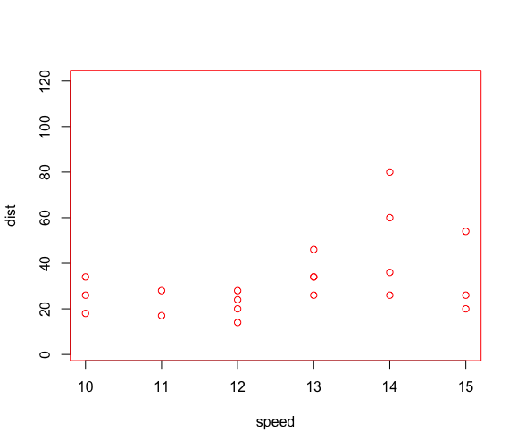

#### Point Shapes

You can also change the shape of the symbols in the plot. The help page for points (`?points`) provides the details.

Plot $cars$ using triangles. (Use `pch = 2` to achieve this effect.)

```R
> plot(cars, pch = 2)
```

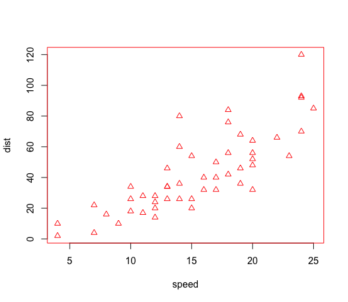

Arguments like `"col"` and `"pch"` may not seem very intuitive. And that is because they aren't! So, many/most people use more modern packages, like **ggplot2**, for creating their graphics in R.

It is, however, useful to have an introduction to base graphics because many of the idioms in lattice and ggplot2 are modeled on them.

## Other Base Graphics Functions

Let's now look at some other functions in base graphics that may be useful, starting with **boxplots**.

### Boxplots with `boxplot()`

Load the $mtcars$ data frame.

```R
> data(mtcars)
```

Anytime that you load up a new data frame, you should explore it before using it. In the middle of a swirl lesson, just type `play()`. This temporarily suspends the lesson (without losing the work you have already done) and allows you to issue commands like `dim(mtcars)` and `head(mtcars)`. Once you are done examining the data, just type `nxt()` and the lesson will pick up where it left off[^1].

[^1]: This is specific to the swirl tutorial environment.

Look up the help page for `boxplot()`.

```R
> help(boxplot)
```

Instead of adding data columns directly as input arguments, as we did with `plot()`, it is often handy to pass in the entire data frame. This is what the `"data"` argument in `boxplot()` allows.

`boxplot()`, like many $R$ functions, also takes a **"formula" argument**, generally an expression with a tilde (`"~"`) which indicates the relationship between the input variables. This allows you to enter something like `mpg ~ cyl` to plot the relationship between $cyl$ (number of cylinders) on the $x$-axis and $mpg$ (miles per gallon) on the $y$-axis.

Use `boxplot()` with `formula = mpg ~ cyl` and `data = mtcars` to create a box plot.

```R
> boxplot(formula = mpg ~ cyl, data = mtcars)
```

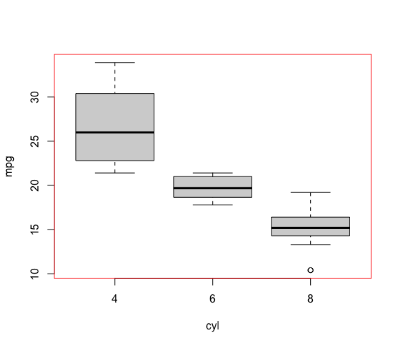

The plot shows that $mpg$ is much lower for cars with more cylinders. Note that we can use the same set of arguments that we explored with `plot()` above to add axis labels, titles and so on.

### Histograms with `hist()`

When looking at a single variable, **histograms** are a useful tool. `hist()` is the associated $R$ function. Like `plot()`, `hist()` is best used by just passing in a single vector.

Use `hist()` with the vector $mtcars\$mpg$ to create a histogram.

```R
> hist(mtcars$mpg)
```

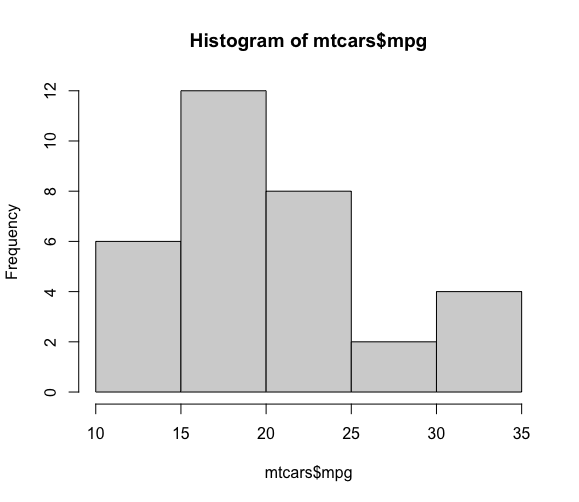

## Summary

In this lesson, you learned how to work with **base graphics** in R. The best place to go from here is to study the **ggplot2** package. If you want to explore other elements of base graphics, then [this web page](http://www.ling.upenn.edu/~joseff/rstudy/week4.html) provides a useful overview.