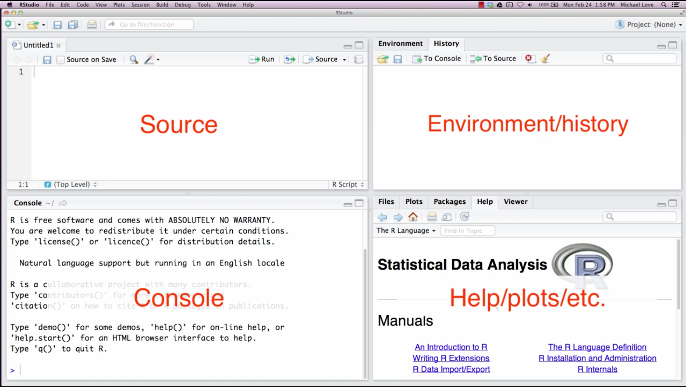
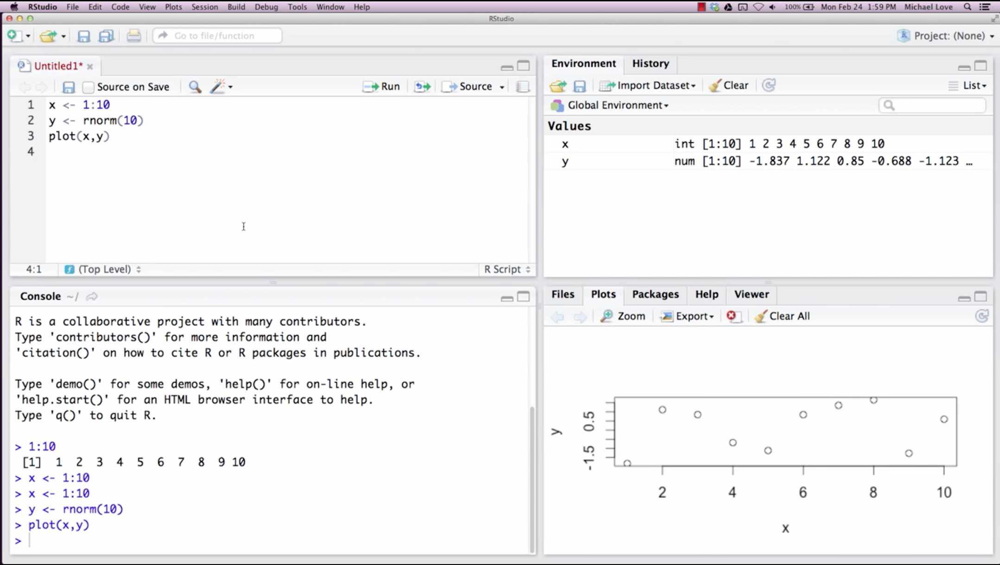

# RStudio Environment

In this module, we're going to briefly introduce the RStudio environment. RStudio has four panels, the source, the console, the environment or history panel, and then fourth panel for help and plots and others.

The **Console** is where you would type in R expressions and have the output printed. For example you can save thee numbers 1 to 10, in a variable $x$. If you click Environment in the top right panel, you can see this variable $x$, which has the values 1 to 10.
In the top left, you can write this out in the **Source** panel. In order to run a command from the Source panel, you can either click the button `Run` or you can use the keyboard shortcut `Control`$-$`Enter`.

In the  **Source** panel we can write another expression, e.g. `rnorm(10)`, and saving the value to $y$, and we can plot $x$ and $y$. When we hit `Control`$-$`Enter`, the plot
shows up in the bottom right corner. And you can use the built-in export function to save plots to either PNG or other, JPEG or PDF files i  your chosen folder.

