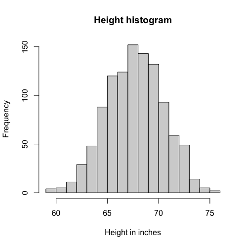

# Exploratory Data Analysis: Histograms

Exploratory data analysis relies on basic tools like the histogram to understand data distributions. We'll demonstrate its utility using a dataset of heights.

## Understanding Data with Histograms

To illustrate, we'll use a dataset called `father.son` from a loaded library, focusing specifically on father's heights, which we'll assign to a variable `x`. Imagine trying to describe this data to someone unfamiliar with height distributions.

First, let's look at the number of individuals in our data. We have $1078$ individuals, making it inconvenient to report every single height. While we could take a random sample of $20$ heights using the `sample` function and round them to the nearest tenth of an inch, this might not be informative enough.

The histogram provides a **visual description** of the data. It works by defining intervals (called `breaks`) and then reporting the number of individuals whose heights fall within each interval. 

```R
hist(x, breaks=seq(floor(min(x)), ceiling(max(x))), 
     main= "Height histogrm", xlab="Height in inches")
```

For instance, we've defined breaks from $59$ to $60$ inches, $60$ to $61$ inches, and so on, up to $76$ inches, covering the range from the shortest to the tallest person in our sample (`breaks=seq(floor(min(x)), ceiling(max(x)))`). This allows us to see how many individuals are within each one-inch interval (e.g., $64$ to $65$ inches, $65$ to $66$ inches). Essentially, one histogram plot can convey almost as much information as all $1078$ individual height measurements.



## Empirical Cumulative Distribution Function (ECDF)

Related to the histogram is the **empirical cumulative distribution function (ECDF)**. What sets the ECDF apart is that for any given number (threshold), it reports the percentage of individuals whose values are below that threshold.
```R
xs <- seq(floor(min(x)), ceiling(max(x)), 0.1)
plot(xs,ecdf(x)(xs), type="l",
    xlab="height in inches", ylab="F(x)")
```

You can define specific thresholds, `xs`, for which to compute these proportions. The `ecdf(x)` function in R creates a function that, when fed these `xs` values, will return the corresponding proportions. Plotting this function allows you to visualize these proportions. For example, if you look at the value $70$ inches on the ECDF plot, you might see that approximately $80\%$ to $85\%$ of the individuals in our data are shorter than $70$ inches.


In the next module, we will explore how to approximate this observed distribution using a theoretical model known as the normal distribution.

---

#### `code.R`

Script file from this lesson.

```R
##-----------------------------------------------------
install.packages("UsingR")
library(UsingR)

##-----------------------------------------------------
x=father.son$fheight


##-----------------------------------------------------
round(sample(x,20),1)


##-----------------------------------------------------
hist(x, breaks=seq(floor(min(x)), ceiling(max(x))), 
     main= "Height histogram", xlab="Height in inches")


##-----------------------------------------------------
xs <- seq(floor(min(x)), ceiling(max(x)), 0.1)
plot(xs,ecdf(x)(xs), type="l",
     xlab="height in inches",
     ylab="F(x)")
```