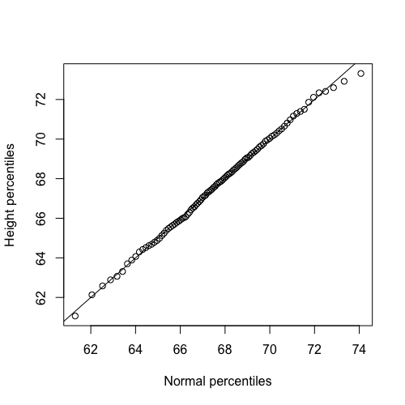
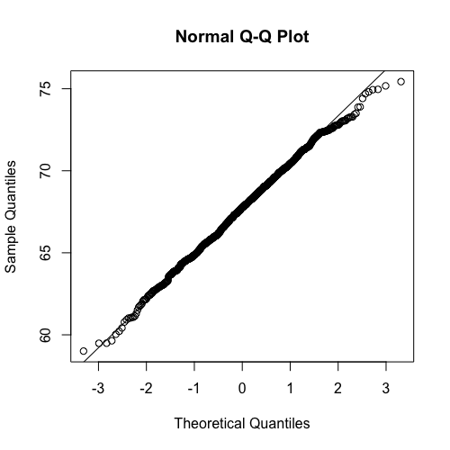

# QQ-Plots

In previous module, we discussed how **histograms** effectively summarize data distributions by showing the proportion of data points within various intervals. We also introduced the concept of the **normal approximation**. If a distribution, such as heights, is *approximately normal*, it can be summarized simply by its **mean** (average) and **standard deviation**.

```R
> mean(x)
[1] 67.6871

> sd(x)
[1] 2.744868
```

For instance, the mean height in our data is approximately $67.7$ inches, and the standard deviation is about $2.75$ inches. If the data distribution is normal, we can use these values to estimate proportions. For example, to find the proportion of individuals taller than $70$ inches, we use the normal approximation with our calculated mean and standard deviation. 

```R
## Find empirically the proportion of 
## individuals taller than 70 inches
> mean(x>70)
[1] 0.2059369

## Estimate the proportion of individuals 
## taller than 70 inches with normal distribution
> 1-pnorm(70, mean(x), sd(x))
[1] 0.1997182
```

Comparing this to the empirical result, both the empirical data and the normal approximation predict that about $20%$ of individuals are above $70$ inches, indicating a very good approximation. Similarly, for individuals shorter than a certain height, the normal approximation also aligns closely with empirical observations. This consistent agreement suggests that the normal distribution serves as an excellent approximation for our data.

```R
## Find empirically the proportion of 
## individuals smaller than 70 inches
> mean(x<70)
[1] 0.7940631

## Estimate the proportion of individuals 
## smaller than 70 inches with normal distribution
> pnorm(70, mean(x), sd(x))
[1] 0.8002818
```

## Quantile-Quantile (Q-Q) Plots

To systematically assess how well the normal distribution approximates our data, we can create a **Quantile-Quantile plot**, or **Q-Q plot** for short.

To construct a Q-Q plot:
* We first define a range of percentiles (`ps`), for example, from 1% to 99%.
```R
ps <- seq(0.01, 0.99, 0.01)
```

* Then, we compute these percentiles from our observed data (`qs`).
```R
qs <- quantile(x, ps)
```

* Next, we compute the same percentiles for a theoretical normal distribution, using the mean and standard deviation of our observed data.
```R
normalqs <- qnorm (ps, mean(x),sd(x))
```

* Finally, we plot the observed percentiles against the percentiles predicted by the normal distribution. We also add a line with an intercept of 0 and a slope of 1 (the 0, 1 line) to the plot.
```R
plot(normalqs,qs,xlab="Normal percentiles", ylab="Height percentiles")
```

Observing how closely the plotted points align with this $0$, $1$ line helps us determine how well the normal distribution predicts our data. In the case of heights, the Q-Q plot typically shows that the normal distribution is very effective at predicting height distributions.



### `qqnorm()` and `qqline()`

R provides convenient functions to create Q-Q plots without needing to manually calculate all percentiles:
* The `qqnorm()` function specifically generates a Q-Q plot comparing your data to a normal distribution.
* The `qqline()` function then adds the reference line (intercept 0, slope 1) to the plot, allowing for easy visual comparison.

```R
qqnorm(x)
qqline(x)
```



#### `code.R`

Script file from this lesson.

```R
##-----------------------------------------------------
install.packages("UsingR")
library(UsingR)

##-----------------------------------------------------
x=father.son$fheight


##-----------------------------------------------------
mean(x<70)
pnorm(70, mean(x), sd(x))


##-----------------------------------------------------
ps <- seq(0.01, 0.99, 0.01)
qs <- quantile(x, ps)
normalqs <- qnorm (ps, mean(x),sd(x))
plot(normalqs,qs,xlab="Normal percentiles", ylab="Height percentiles")
abline(0,1) ##identity line


##-----------------------------------------------------
qqnorm(x)
qqline(x)

```