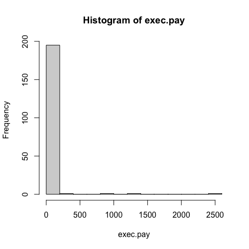
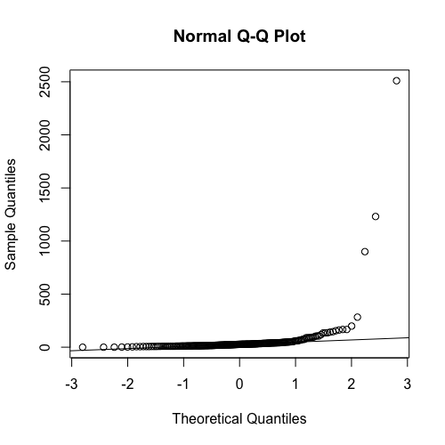
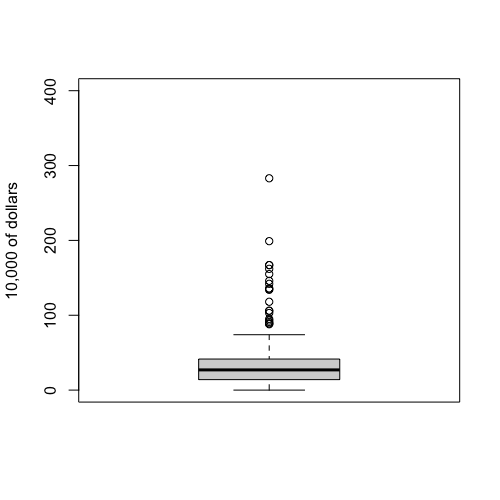

# Boxplot

When data does not follow a normal distribution, the mean and standard deviation may not be good summaries. An example of such data is executive salaries.

Using the `usingR` library, we can visualize the distribution of executive salaries with a histogram. This histogram clearly shows a distribution that looks "nothing like normal". There are many executives earning between $0$ and $250$ (presumably in thousands of dollars), but also some who are paid significantly more.

```R
hist(exec.pay)
```



If we create a Q-Q plot (using `qqnorm()`), it becomes immediately evident that the data does not follow a normal distribution. Statisticians refer to this as a "*fat right tail*", indicating there are data points that are much larger than expected if the data were normally distributed.

```R
qqnorm(exec.pay)
qqline(exec.pay)
```



In such cases, reporting the mean and standard deviation would not accurately represent the distribution of the data.

## Boxplots as a Better Summary

A more general and often better summary for non-normally distributed data is the **boxplot**. The boxplot is a simple graphical tool that displays five key numbers and can also indicate outliers.

```R
boxplot(exec.pay,ylab="10,000 of dollars",ylim=c(0,400))
```

The boxplot shows:
* The **median**: represented by a line within the box. For the salary data, the median is around 50, which is notably different from the mean (the median is about half of what the mean is).
```R
> mean(exec.pay)
[1] 59.88945
> median(exec.pay)
[1] 27
```
* The **25th percentile** and the **75th percentile**: these form the boundaries of the box. This box visually represents where the middle 50% of the data, or the "middle half," is contained.
* The **range of the data** (excluding outliers, which are defined in a specific way by R's boxplot implementation; details can be found in the help file).



In general, the boxplot provides a clear and effective graphical summary of these five key numbers, giving a good overview of the data's distribution.

#### `code.R`

Script file from this lesson.

```R
##-------------------------------------------------
library(UsingR)


##-------------------------------------------------
hist(exec.pay)
qqnorm(exec.pay)
qqline(exec.pay)


##-------------------------------------------------
boxplot(exec.pay,ylab="10,000 of dollars",ylim=c(0,400))
mean(exec.pay)
median(exec.pay)
```
