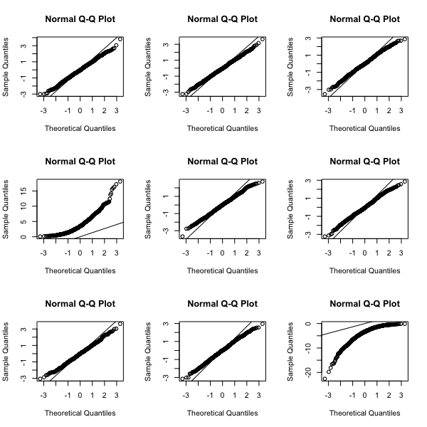
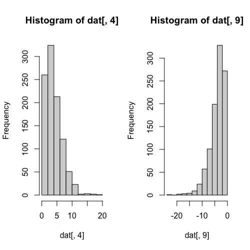

## QQ-plot Exercises

Download this RData file to your working directory. Then load the data into R with the following command:

```R
load("skew.RData")
```

You should have a 1000 x 9 dimensional matrix 'dat':

```R
dim(dat)
```

Using QQ-plots, compare the distribution of each column of the matrix to a normal. That is, use `qqnorm()` on each column. To accomplish this quickly, you can use the following line of code to set up a grid for 3x3=9 plots. (`mfrow` means we want a *multifigure grid filled in row-by-row*. Another choice is `mfcol`.)

```R
par(mfrow = c(3,3))
```

Then you can use a for loop, to loop through the columns, and display one `qqnorm()` plot at a time. You should replace the text between ** with your own code.

```R
for (i in 1:9) {
  qqnorm(dat[,i])
  qqline(dat)
}
```



Identify the two columns which are skewed. **Answer: 4 and 9.**

Examine each of these two columns using a histogram. Note which column has "positive skew", in other words the histogram shows a long tail to the right (toward larger values). Note which column has "negative skew", that is, a long tail to the left (toward smaller values). Note that positive skew looks like an up-shaping curve in a `qqnorm()` plot, while negative skew looks like a down-shaping curve.

You can use the following line to reset your graph to just show one at a time:

```R
par(mfrow=c(1,1))
```

### QQ-plot Exercises #1 and #2


