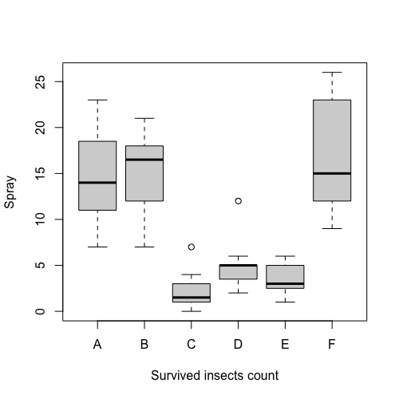
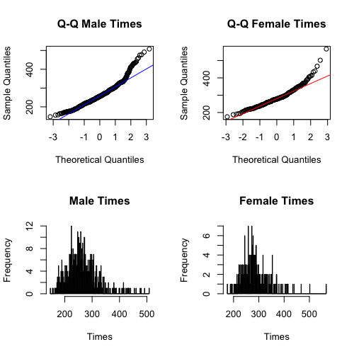
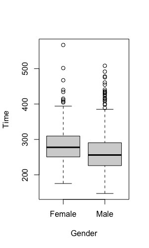
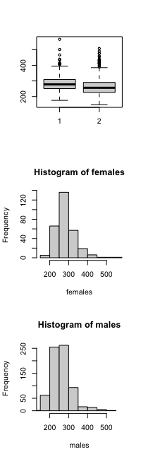

## Boxplot Exercises

### Boxplot Exercises #1
The `InsectSprays` data set measures the counts of insects in agricultural experimental units treated with different insecticides. This dataset is included in R, and you can examine it by typing:

```R
head(InsectSprays)
```

Try out two equivalent ways of drawing boxplots in R, using the `InsectSprays` dataset. Below is pseudocode, which you should modify to work with the `InsectSprays` dataset.

1) using split:

```R
boxplot(split(values, factor))
```

2) using a formula:

```R
boxplot(values ~ factor)
```

Which spray seems the most effective (has the lowest median count)? **Answer: C**

```R
boxplot(split(InsectSprays$count, InsectSprays$spray))

## Or

boxplot(InsectSprays$count ~ InsectSprays$spray, 
        xlab="Survived insects count", ylab="Spray")
```



### Boxplot Exercises #2

Which are the groups with visible outliers? **Answer: C and D**

### Boxplot Exercises #3

Let's consider a random sample of finishers from the New York City Marathon in 2002. This dataset can be found in the `UsingR` package. Load the library and then load the `nym.2002` dataset.

```R
library(dplyr)
data(nym.2002, package="UsingR")
```

Use boxplots and histograms to compare the finishing times of males and females. Which of the following best describes the difference?

```R
par(mfrow = c(2,2))

male_times <- nym.2002$time[nym.2002$gender == "Male"]
female_times <- nym.2002$time[nym.2002$gender == "Female"]

qqnorm(male_times,main="Q-Q Male Times")
qqline(male_times,col="Blue")
qqnorm(female_times,main="Q-Q Female Times")
qqline(female_times,col="Red")

hist(male_times,
     breaks=seq(floor(min(male_times)),ceiling(max(male_times))), 
     main= "Male Times", xlab="Times")
hist(female_times,
     breaks=seq(floor(min(female_times)), ceiling(max(female_times))), 
     main= "Female Times", xlab="Times")
```



```R
boxplot(nym.2002$time ~ nym.2002$gender, xlab="Gender", ylab="Time")
```




Use boxplots and histograms to compare the finishing times of males and females. Which of the following best describes the difference?

**Answer: Male and females have similar right skewed distributions with the former, 20 minutes shifted to the left.**

### Solution

```R
mypar(1,3)
males <- filter(nym.2002, gender=="Male") %>% select(time) %>% unlist
females <- filter(nym.2002, gender=="Female") %>% select(time) %>% unlist
boxplot(females, males)
hist(females,xlim=c(range(nym.2002$time)))
hist(males,xlim=c(range(nym.2002$time)))
```

