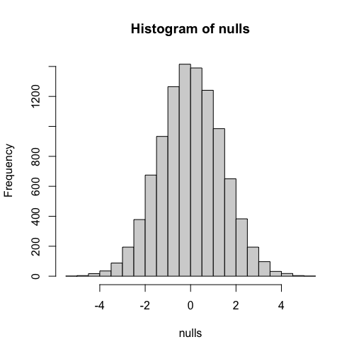

# Introduction to Null Distributions

In this lesson, we'll delve into the concepts of **null distribution** and **p-values** using our familiar mouse weight example. Recall that the average weight of mice on a high-fat diet was $3$ grams greater than those on a control diet. We'll refer to this $3$-gram difference as our **observation**. Our goal is to demonstrate how statistical inference, specifically through the calculation of a p-value, supports scientific statements.

## The Skeptical Approach: Could it be Chance?

As skeptics, we must question whether our observed $3$-gram difference could simply be due to chance. To test this statistically, we leverage a unique aspect of our mouse weight example: access to the entire population of control mice. While rarely available in real-world scenarios, having the full population here allows us to illustrate fundamental concepts.

We load the control population data, which is a data frame containing the weights of all control female mice. We then convert this into a numeric vector using the `unlist()` function, a necessary step for the subsequent calculations.

```R
library(dplyr)
dat <- read.csv("femaleMiceWeights.csv")

control <- filter(dat,Diet=="chow") %>%
  select(Bodyweight) %>% unlist

treatment <- filter(dat,Diet=="hf") %>%
  select(Bodyweight) %>% unlist

obs <- mean(treatment) - mean(control)

population <- read.csv("femaleControlsPopulation.csv") %>% unlist()
```

## Understanding the Null Hypothesis and Null Distribution

Next, we explore what happens when the **null hypothesis** is true. The null hypothesis states that there is no effect of the high-fat diet; in other words, there is no difference in weight due to the diet. Practically, this means that if we were to take a new set of control mice and a new set of "treatment" mice, there would be no actual difference between them. We can simulate this by effectively assigning control mice to both the "control" and "treatment" groups, as they would both be drawn from the same underlying population.

This simulation is akin to obtaining 12 new mice, giving them a placebo (like chow), weighing them, and then recalculating the difference in means. When we perform this simulation once, we might observe a mean difference of $-0.7$ grams. If we repeat this process multiple times, each iteration yields a different difference, ranging from, for example, $-1.5$ to $1.5$. These different differences are **realizations of the difference in mean under the null hypothesis**.

```R
> control <- sample(population, 12)
> treatment <- sample(population, 12)
> mean(treatment) - mean(control)
[1] 0.7641667
```

This collection of all possible differences in means that could occur if the null hypothesis were true is known as the **null distribution**. If we know the null distribution, we can describe the proportion of values that fall within any given interval.

## Simulating the Null Distribution

To build a robust null distribution, we're going to repeat this simulation 10,000 times, recording each difference in means under the null hypothesis. We'll store these 10,000 differences in an empty vector, `nulls`, which we initialize to a size of 10,000. While a `for-loop` might not be the most efficient method in R, it's used here for clarity.

```R
n <- 10000
nulls <- vector("numeric",n) ## Initialize vector
for(i in 1:n){
  control <- sample(population, 12)
  treatment <- sample(population, 12)
  nulls[i] <- mean(treatment) - mean(control)
}
```

After running the simulation 10,000 times, we have 10,000 values in `nulls`. We can inspect these values; for example, the largest observed difference under the null could be $4.72$, which is even larger than our initial $3$-gram observation.

```R
> max(nulls)
[1] 4.728333
> min(nulls)
[1] -4.6075
```

A histogram of these `nulls` values visually represents the **null distribution**. We observe that most values cluster around $-2$ and $2$, but there are indeed some larger values, including those around $\pm$6. This histogram provides a clear picture of the null distribution of this random variable (the difference in means).



## Calculating the P-value

With the null distribution in hand, we can now assess how likely it is to observe a difference as large as our original $3$-gram observation purely by chance, under the null hypothesis. This is where the **p-value** comes in.

The p-value is the proportion of times that a value from the null distribution is greater than or equal to what we observed. To calculate this, we count how many times the values in `nulls` are greater than our `obs` ($3$ grams) and then divide that count by the total number of simulations (`n`). A simpler way to compute this in R is by taking the mean of a logical vector (`nulls > obs`).

```R
> sum(nulls>obs)/n
[1] 0.0145
> mean(nulls>obs)
[1] 0.0145
```

For our example, this calculation might reveal that the null value was larger than our observation only $1.45\%$ of the time. If we consider values that are larger in absolute terms (i.e., differences as extreme as $3$ grams in either direction), it might occur about $2.8\%$ of the time. This $0.028$ is our p-value.

```R
> mean(abs(nulls)>obs)
[1] 0.0285
```

**The p-value directly answers the question: What is the probability that an outcome from the null distribution is as extreme as (or more extreme than) what we observed, assuming the null hypothesis is true?**

In scientific literature, a p-value of $0.028$ (or $2.8\%$) is typically considered small enough to report a statistically significant result. However, it's important to remember that the p-value is a continuous number and doesn't necessarily represent an "either/or" (significant/not significant) situation, though this is how many journals often present findings. Our p-value here is definitively $0.0285$.

Now, we have a clear understanding of null distributions and p-values, derived from an illustrative case where we had access to population data. In practice, obtaining population data is rare. Much of this course will focus on how to make these calculations and estimate p-values using mathematical approximations when you only have a single dataset. Later, we will also explain **confidence intervals**, which are often preferred over simply reporting p-values.

#### `code.R`

Script file from this lesson.

```R
library(dplyr)
dat <- read.csv("femaleMiceWeights.csv")

control <- filter(dat,Diet=="chow") %>%
  select(Bodyweight) %>% unlist

treatment <- filter(dat,Diet=="hf") %>%
  select(Bodyweight) %>% unlist

obs <- mean(treatment) - mean(control)

population <- read.csv("femaleControlsPopulation.csv") %>% unlist()
population <- unlist(population) # To make it a numerical vector from a data.frame

max(nulls)
hist(nulls)

n <- 10000
nulls <- vector("numeric",n)
for(i in 1:n){
  control <- sample(population, 12)
  treatment <- sample(population, 12)
  nulls[i] <- mean(treatment) - mean(control)
}

sum(nulls>obs)/n
mean(abs(nulls)>obs)
```
