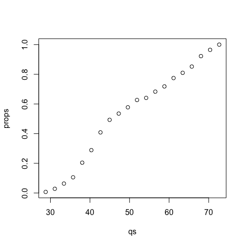
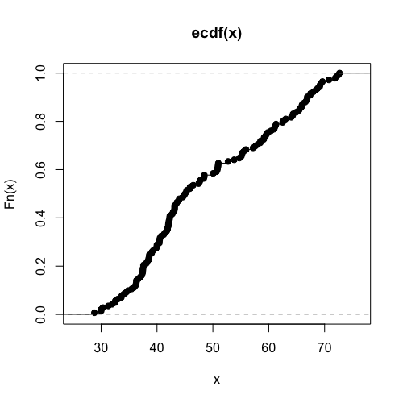

# `sapply()` on a custom function

## Introduction

Based on the data used in [03-probability-distribution.md](../exercises/03-probability-distribution.md). To install and load them use:

```R
install.packages("gapminder")
library(gapminder)
data(gapminder)
head(gapminder)
```

Run also this code from question $1.1$:

```R
dat1952 = gapminder[gapminder$year == 1952,]
x = dat1952$lifeExp
mean(x <= 40)
```

## How to use `sapply()` on a custom function

Suppose we want to plot the proportions of countries with life expectancy $q$ for a range of different years. R has a built in function for this, `plot(ecdf(x))`, but suppose we didn't know this. The function is quite easy to build, by turning the code from question $1.1$ into a custom function, and then using `sapply()`. Our custom function will take an input variable $q$, and return the proportion of countries in $x$ less than or equal to $q$. The curly brackets, `{` and `}`, allow us to write an R function which spans multiple lines:

```R
prop = function(q) {
  mean(x <= q)
}
```

Try this out for a value of $q$: `prop(40)`

Now let's build a range of $qs$ that we can apply the function to:

```R
qs = seq(from=min(x), to=max(x), length=20)
```

Print $qs$ to the R console to see what the `seq()` function gave us. Now we can use `sapply()` to apply the prop function to each element of $qs$:

```R
props = sapply(qs, prop)
```

Take a look at props, either by printing to the console, or by plotting it over $qs$:

```R
plot(qs, props)
```



Note that we could also have written this in one line, by defining the prop function inside of `sapply()` but without naming it:

```R
props = sapply(qs, function(q) mean(x <= q))
```

This last style is called using an "inline" function or an "anonymous" function. Let's compare our homemade plot with the pre-built one in R:

```R
plot(ecdf(x))
```



#### `code.R`

Script file from this lesson.

```R
install.packages("gapminder")
library(gapminder)
data(gapminder)
head(gapminder)

dat1952 = gapminder[gapminder$year == 1952,]
x = dat1952$lifeExp
mean(x <= 40)

prop = function(q) {
  mean(x <= q)
}

prop(40)

qs = seq(from=min(x), to=max(x), length=20)
qs

props = sapply(qs, prop)
props

plot(qs, props)

plot(ecdf(x))
```
