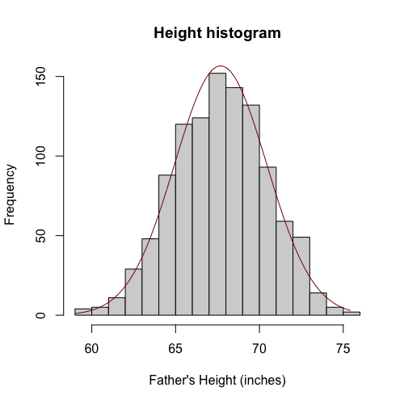
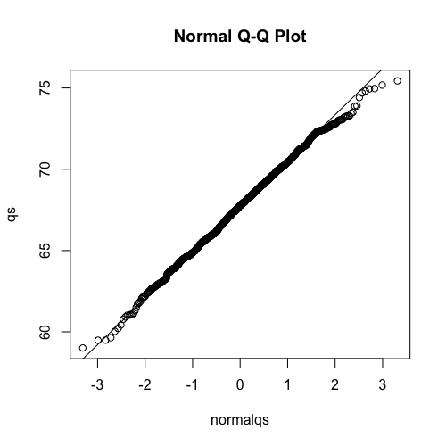

# The Normal Distribution

In this module, we will introduce the **normal distribution**, also known as the **bell curve** or the **Gaussian distribution**. Its formula tells us that the proportion of numbers between `a` and `b` is given by an integral.

```math
\text{Pr}(a \leq x \leq b) = \int_a^b \frac{1}{\sigma \sqrt{2\pi}}e^{-\frac{1}{2}(\frac{x-\mu}{\sigma})^2} \; dx
```

The two key numbers in this formula are $\mu$ and $\sigma$. $\mu$ represents the **average** (or **mean**), and $\sigma$ represents the **standard deviation**. These two numbers are the only ones needed to define the integral. This means that if a list of numbers follows a normal distribution, and we know its mean and standard deviation, we know everything about that distribution. We can answer questions like, "What's the proportion of `x`'s that are between any `a` and any `b`?"

If your data's distribution is approximated by a normal distribution, you can quickly determine the proportion of your data within any given interval. For example, you will know that:
* Approximately $95\%$ of your data falls within two standard deviations of the average ($2\sigma$).
* Approximately $99\%$ of your data falls within $2.5$ standard deviations of the average ($2.5\sigma$).
* Approximately $68\%$ of your data falls within one standard deviation of the average ($1\sigma$).

Let's use our height example. The mean height is about $68$ inches, and the standard deviation is about $3$ inches. Since height data is approximately normal, if someone asks for the proportion of adults between $65$ inches and $71$ inches, we don't need to count them. Because this interval is one standard deviation away from the mean ($68 \pm 3$), we know that about $68\%$ will be very close to the correct answer.

The **average** (mean) is calculated by summing all the heights and dividing by the total number of adults.

```math
\mu = \frac{1}{M}\sum_{i = 1}^{M}x_i
```

The **standard deviation** is like an *average distance from the mean*. Mathematically, it's often computed as the square root of the **variance**, where variance is the average of the squared distances from the mean.

```math
\sigma^2 = \frac{1}{M}\sum_{i = 1}^{M}(x_i-\mu)^2
```

## Quantile-Quantile (Q-Q) Plots for Assessing Normality

If we look at a histogram of heights and overlay a normal distribution with the mean and standard deviation derived from the height data, we can see that it provides a very good approximation.



To rigorously check how well the normal distribution approximates our data, we use a **quantile-quantile (Q-Q) plot**.
* We compute percentiles (e.g., $1\%$, $2\%$, $3\%$, etc.) for our dataset.
* We also compute the same percentiles for a theoretical normal distribution.
* We then plot the normal distribution's percentiles on the x-axis against our data's percentiles on the $y$-axis.



If the two distributions are identical, the points on the plot should fall on the identity line (where $x = y$). If they are close to this line, it indicates a good approximation. In the case of heights, the points on the Q-Q plot are generally very close to the identity line, confirming that it's a good normal approximation.

## Standard Units (Z-scores)

The concept of **standard units**, or **$z$-scores**, is extremely useful. If your data is approximately normal, you can convert each data point into a $z$-score by subtracting the mean ($overline{X}$) and dividing by the standard deviation ($s_X$):

```math
Z_i = \frac{X_i - \overline{X}}{s_X}
```

These $z$-scores will have a mean of $0$ and a standard deviation of $1$. This transformation allows us to interpret values regardless of their original units. A $z$-score of $2$ or $3$ indicates a value that is $2$ or $3$ standard deviations away from the mean, respectively. For normally distributed data, only about $5\%$ of the data is more than two standard deviations away from the mean. This standardization is a convenient transformation used frequently in data analysis.

## Summary

In summary, if your data is well-approximated by the normal distribution, then the **mean** and **standard deviation** are sufficient to summarize everything important about that data. With these two numbers, you can describe the proportion of data within any interval.

However, this only applies when your data is normally distributed. For quantities that are not normally distributed, such as income distribution or gene expression data (without a log transformation), the mean and standard deviation cannot be considered comprehensive summaries in the same way. While they might be useful for certain calculations, they will not fully describe the data's distribution as they do for normal data.

#### `code.R`

Script file from this lesson.

```R
install.packages("UsingR")
library(UsingR)

x=father.son$fheight

## To build the histogram plot with Guassian distribution
hist_info <- hist(x, breaks=seq(floor(min(x)), ceiling(max(x))), 
     main= "Height histogram", xlab="Father's Height (inches)")

x_mean <- mean(x)
x_sd <- sd(x)

x_values <- seq(min(x), max(x), length.out = 100)
gaussian_density <- dnorm(x_values, mean = x_mean, sd = x_sd)

scaling_factor <- length(x) * (hist_info$mids[2] - hist_info$mids[1])
scaled_gaussian_density <- gaussian_density * scaling_factor

lines(x_values, scaled_gaussian_density, col = "darkred", lwd = 1)

## To build the QQ plot
qqnorm(x, xlab="normalqs", ylab="qs")
qqline(x)
```