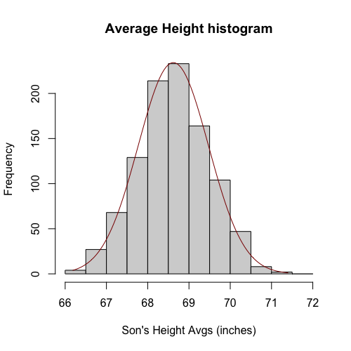
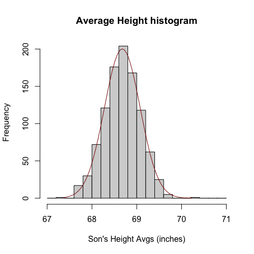

# The Central Limit Theorem

The **Central Limit Theorem (CLT)** is a cornerstone of statistical inference. It states that the sample average of a sufficiently large number of independent and identically distributed random variables will be approximately normally distributed, regardless of the original distribution of the data.

More specifically, for a sample average, denoted as $\bar{X}$:
* It follows a normal distribution.
* Its mean is the population average, $\mu_{X}$.
* Its standard deviation is $\sigma_{X} / \sqrt{N}$, where $\sigma_{X}$ is the population standard deviation and $N$ is the sample size.

```math
\bar{X} \sim N(\mu_X,\frac{\sigma_X}{\sqrt{M}})

\;\;\;\;\;\;\;

\bar{Y} \sim N(\mu_Y,\frac{\sigma_Y}{\sqrt{M}})
```

This is a profoundly powerful result because if the CLT holds true, and we know $\mu$ and $\sigma$, we can determine the probability of the sample average falling within any given interval.

## Understanding Population Standard Deviation ($\sigma$)

Before proceeding, let's define $\sigma_X$, the **population standard deviation**. This value quantifies the average distance of a typical individual from the population mean. For instance, in the case of human heights, the population standard deviation might be around $3$ inches. The variance, which is the standard deviation squared ($\sigma_X^2$), is often defined first due to mathematical convenience. The standard deviation helps us understand how much the population varies around its mean.

```math
\sigma^2_X = \frac{1}{m}\sum_{i = 1}^{m}(x_i-\mu_X)^2

\;\;\;\;\;\;\;

\sigma^2_Y = \frac{1}{n}\sum_{i = 1}^{n}(y_i-\mu_Y)^2
```

## Visualizing the Central Limit Theorem

Let's illustrate the CLT with a simulation. We'll fix the sample size at $N=10$. We repeatedly take samples of $10$ individuals and calculate their average height. Each time, we get a different sample average. If we plot a histogram of these sample averages, we observe that as we take more and more samples, the histogram of the sample averages increasingly resembles a normal distribution. In this histogram, the red line represents the normal approximation predicted by the CLT, showing a close fit after many samples.



The resulting distribution of sample averages is approximately normal, centered around the true population mean (e.g., around $69$ inches). The spread of this distribution is referred to as the **standard error**, which is essentially the standard deviation of the sample average's distribution.

What happens if we increase the sample size, say to $N=50$? The same pattern emerges: the distribution of sample averages is still normal and centered around the true mean. However, as predicted by the CLT (where the standard deviation is $\sigma_x / \sqrt{N}$), the spread of this distribution becomes smaller. A larger sample size leads to a more precise estimate of the population mean.



## Applying the Central Limit Theorem in Practice

In practical applications, we are often interested in the difference between two sample averages, such as $\bar{Y} - \bar{X}$ (e.g., the difference in average heights between men and women). This difference is also a random variable, changing with each new sample. We want to understand how much this difference varies.

The CLT, combined with statistical theory, tells us that the difference between two normally distributed random variables is also normally distributed. Furthermore, the variance of the difference of two independent random variables is the sum of their individual variances. To get the standard deviation of the difference, we take the square root of this sum.

```math
\frac{\bar{Y}-\bar{X}}{\sqrt{\frac{\sigma^2_X}{M}+\frac{\sigma^2_Y}{N}}} \sim N(0,1)
```

This means we can standardize the difference by subtracting the expected difference (which is $0$ under the null hypothesis, assuming no actual difference between population means) and dividing by its standard deviation. This standardized value will follow a normal distribution with a mean of $0$ and a standard deviation of $1$ (a standard normal distribution). This allows us to calculate the probability of observing a certain difference or a more extreme one.

The reason the mean of the standardized difference is $0$ under the null hypothesis is that we assume the population means of men and women are the same. Therefore, when you subtract them, the expected difference is $0$.

One practical challenge is that we usually do not know the true population standard deviations ($\sigma_X$ and $\sigma_Y$). In the next module, we will discuss the **t-test**, which provides a way to address this by constructing a quantity that allows us to determine if an observed difference (like our $3.3$-inch difference) is genuinely different from $0$ or merely due to chance.

#### `code.R`

Script file from this lesson.

```R
## Code for the figures
library(UsingR)
df <- data.frame(father.son)

x <- replicate(1000, mean(sample(father.son$sheight, 10))) ## Changed to `sample(father.son$sheight, 50)` for the second figure

par(mfrow = c(1,1))

hist_info <- hist(x, breaks=seq(floor(min(x)), ceiling(max(x)), by = 0.5), ## Changed `by` to 0.2 for the second figure
                  main= "Average Height histogram", xlab="Son's Height Avgs (inches)")

x_mean <- mean(x)
x_sd <- sd(x)

x_values <- seq(min(x), max(x), length.out = 100)
gaussian_density <- dnorm(x_values, mean = x_mean, sd = x_sd)

scaling_factor <- length(x) * (hist_info$mids[2] - hist_info$mids[1])
scaled_gaussian_density <- gaussian_density * scaling_factor

lines(x_values, scaled_gaussian_density, col = "darkred", lwd = 1)
```