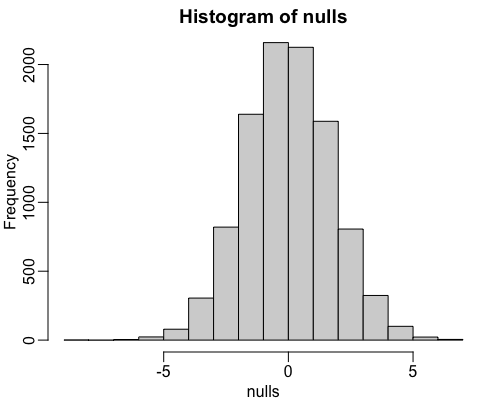
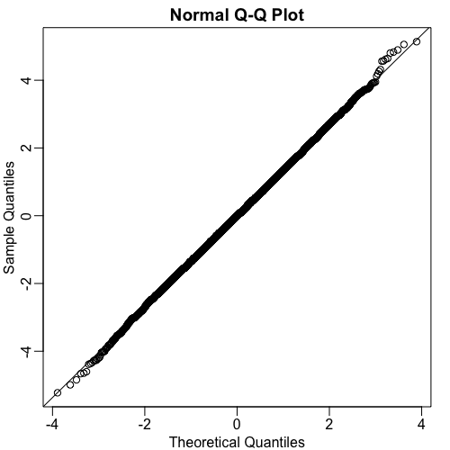
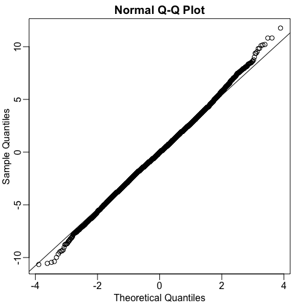

# Central Limit Theorem in Practice

In this module, we will demonstrate the practical usefulness of the Central Limit Theorem (CLT). We previously created a null distribution by repeatedly sampling from our original population data. This null distribution represents the possible differences in means under the null hypothesis (i.e., no actual difference between groups). Our aim now is to show how well this null distribution is approximated by a normal distribution.

To make the figures clearer, we can use the `rafalib` package (which you can install if you don't already have it).

## Approximating the Null Distribution with Normality

We'll begin by examining the null distribution generated from samples of size $N=12$. Even from a simple histogram, we can visually see that it strongly resembles a normal distribution. 



To confirm this more rigorously, we use the `qqnorm()` function, which creates a Q-Q plot comparing our observed data (the null distribution) to a theoretical normal distribution. Adding a `qqline()` to this plot should show a line passing directly through the data points if the distribution is indeed normal. As we observe, the Q-Q line passes almost perfectly through the data, confirming that the difference in averages follows a normal distribution.



## Impact of Sample Size on Normal Approximation

What happens if we reduce the sample size? Let's try the same experiment with a smaller sample size, say $N=3$, instead of $12$. The Central Limit Theorem, while powerful, requires a sufficiently large sample size for the normal approximation to be accurate. With a small $N=3$, the approximation might not be as precise.

When we simulate with $N=3$, the normal approximation becomes slightly less accurate. You might notice that the tails of the distribution appear a bit "fatter" than before, meaning there are more extreme values than a perfect normal distribution would predict.



The main takeaway from this exercise is to illustrate just how good the normal approximation can be when the conditions for the CLT are met. When we can rely on this approximation, it provides a crucial advantage: we no longer need direct access to the entire population data to compute p-values or confidence intervals. Instead, we can assume that our null distribution is normally distributed with a certain mean and variance, and then perform our statistical calculations.

This brings us closer to what is done in real-world statistical practice. In subsequent videos and throughout the rest of this course, we will further explore how to use the Central Limit Theorem to obtain p-values, construct confidence intervals, and perform statistical inference in general.

#### `code.R`

Script file from this lesson.

```R
## From the lesson and the book it is impossible 
## to trace back what the `population` and `obs` 
## variables represent or come from, so I just 
## took it from the most probable file it came 
## from. Still the graph do not correspond to the 
## ones in the lesson although they are very 
## similar to the ones you can produce with this
## script.

library(downloader)
url <- "https://raw.githubusercontent.com/genomicsclass/dagdata/refs/heads/master/inst/extdata/femaleControlsPopulation.csv"
filename <- basename(url)
download(url, destfile=filename)
population <- na.omit( read.csv(filename) )
population <- unlist(population)

library(dplyr)
n <- 10000
nulls <- vector("numeric", n)
for(i in 1:n){
  control <- sample( population, 12) ## Or 3
  treatment <- sample( population, 12) ## Or 3
  nulls[i] <- mean(treatment)-mean(control)
}

library(rafalib)
mypar()

qqnorm(nulls)
qqline(nulls)
```