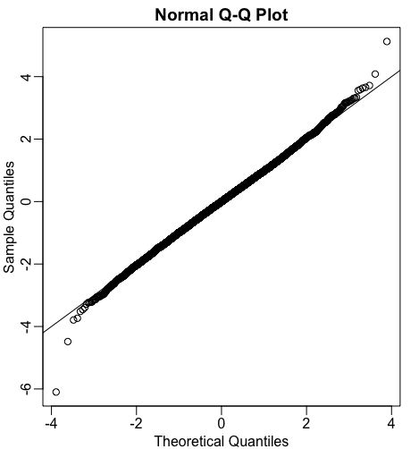
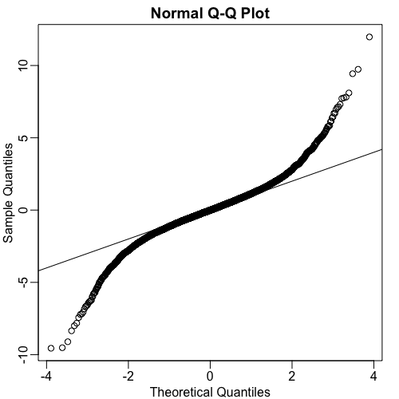

# T-test

In this video, we explore how the Central Limit Theorem (CLT) is applied with t-statistics to obtain p-values and, later, confidence intervals. We continue with our mouse weight example, where we previously calculated the difference in mean weights between the high-fat diet and control groups[^1].

[^1]: Actually, I think that the lesson where they did that was not included in this online course.

NB: When not finding the origin of some variables in the code snippets refer to the code at the end of the page.

## Constructing the T-statistic

To work with t-statistics, we first need to estimate the standard error of the observed difference in means. This is done by calculating the square root of the sum of the variances of each sample divided by their respective sample sizes. Specifically, for our two groups (e.g., treatment and control), the estimated standard error is calculated as:

```math
\sqrt{(\text{var(treatment)} / N) + (\text{var(control)} / N)}
```

where $\text{var()}$ is the sample variance and $N$ is the sample size for each group.

```R
se <- sqrt(
  var(treatment)/N+
    var(control)/N )
```

Once we have this estimated standard error, we can form the **t-statistic** by dividing the observed difference in means by its estimated standard deviation (i.e., the standard error):

```math
\text{t-statistic} = \text{observed difference} / \text{estimated standard error}
```

```R
tstat <- obs / se
```

## Obtaining P-values with the Normal Approximation

A powerful aspect of the Central Limit Theorem is that if we assume the normal approximation holds for the null distribution (the distribution of the t-statistic if there were no true difference between groups), we don't need access to the entire population data. This is crucial for realistic situations where population data is unavailable.

The CLT tells us that the null distribution of the t-statistic is approximately a standard normal distribution, meaning it has a mean of $0$ and a variance of $1$. With this knowledge, we can compute p-values using standard normal probabilities.

The `pnorm()` function in R returns the proportion of normally distributed data (with mean $0$ and standard deviation $1$) that is less than a given value. To find the p-value for an observed t-statistic in a two-tailed test (which checks for differences in either direction), we calculate the probability of observing a value more extreme than our t-statistic in one tail and then multiply it by $2$. This gives us an estimate of the p-value using only our sample data.

```R
2* (1 - pnorm(tstat) )
```

## Assessing the Quality of the Approximation

We can assess the quality of this normal approximation by using our population data (which we have for illustration, but not in real-world scenarios). We can simulate the null distribution of the t-statistic by dividing the null differences (from our previous simulations) by the estimated standard error.

```R
n <- 10000
nulls <- vector("numeric", n)
for(i in 1:n){
  control <- sample( population, N)
  treatment <- sample( population, N)
  se <- sqrt(
    var(treatment)/N+
      var(control)/N )
  nulls[i] <- (mean(treatment)-mean(control))/se
}
```

After generating many such simulated t-statistics under the null hypothesis, we can create a Q-Q plot comparing this simulated null distribution to a theoretical normal distribution. If the CLT provides a good approximation, the points on the Q-Q plot should fall almost perfectly along the line with intercept $0$ and slope $1$. This indicates that our obtained p-value is a good approximation of the true p-value.

```R
qqnorm(nulls)
abline(0,1)
```



## The Impact of Sample Size

It's important to understand the role of sample size. If we repeat our simulation with a very small sample size, for example, $N=3$ instead of $N=12$, the normal approximation for the null distribution of the t-statistic becomes much less accurate. 

```R
n <- 10000
nulls <- vector("numeric", n)
for(i in 1:n){
  control <- sample( population, 3)
  treatment <- sample( population, 3)
  se <- sqrt(
    var(treatment)/3+
      var(control)/3 )
  nulls[i] <- (mean(treatment)-mean(control))/se
}
```

When we create a Q-Q plot for $N=3$, the points deviate significantly from the $0, 1$ line, especially in the tails, indicating that the normal approximation is not suitable for such a small sample in this dataset.



This simulation highlights why larger sample sizes are generally needed for the normal approximation to be valid. For cases with small sample sizes where the original data can be assumed to follow a normal distribution, alternative approximations, such as the t-distribution (which we will discuss), might be more appropriate.

In subsequent videos and throughout the course, we will continue to build on these concepts, showing how the Central Limit Theorem is used to obtain p-values, construct confidence intervals, and perform statistical inference in general.

#### `code.R`

Script file from this lesson.

```R
library(downloader)
url <- "https://raw.githubusercontent.com/genomicsclass/dagdata/refs/heads/master/inst/extdata/femaleMiceWeights.csv"
filename <- basename(url)
download(url, destfile=filename)
dat <- na.omit( read.csv(filename))

library(dplyr)

control <- filter(dat, Diet=="chow") %>%
  select(Bodyweight) %>% unlist

treatment <- filter(dat, Diet=="hf") %>%
  select(Bodyweight) %>% unlist

N <- length(treatment)
obs <- mean(treatment) - mean(control)

se <- sqrt(
  var(treatment)/N+
    var(control)/N )
tstat <- obs / se

2* (1 - pnorm(tstat) )

#-------------------------------------------------------

library(downloader)
url <- "https://raw.githubusercontent.com/genomicsclass/dagdata/refs/heads/master/inst/extdata/femaleControlsPopulation.csv"
filename <- basename(url)
download(url, destfile=filename)
population <- na.omit( read.csv(filename) ) %>% unlist

n <- 10000
nulls <- vector("numeric", n)
for(i in 1:n){
  control <- sample( population, 3)
  treatment <- sample( population, 3)
  se <- sqrt(
    var(treatment)/3+
      var(control)/3 )
  nulls[i] <- (mean(treatment)-mean(control))/se
}

library(rafalib)
mypar()

qqnorm(nulls)
abline(0,1)
```