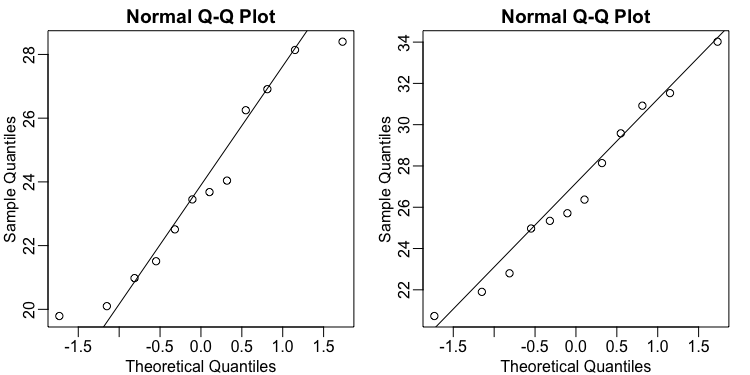

# T-test in Practice

Up to now, our focus has been on understanding statistical concepts, often by using population data that is typically unavailable in real-world scenarios. In practice, when faced with a dataset, you'll employ specific functions to perform statistical tests. Here, we'll demonstrate how to construct a t-statistic, calculate a p-value, and determine confidence intervals using R's built-in functionality.

## The `t.test()` Function

The first step in a practical analysis is to load your data. In our mouse weight example, this would involve reading in the $12$ measurements for the control group and $12$ for the high-fat diet group.

```R
library(dplyr)
dat <- na.omit( read.csv("femaleMiceWeights.csv"))

control <- filter(dat, Diet=="chow") %>%
  select(Bodyweight) %>% unlist

treatment <- filter(dat, Diet=="hf") %>%
  select(Bodyweight) %>% unlist
```

Fortunately, R provides a convenient function, `t.test()`, that automates the computation of the mean difference, estimation of the standard error, and calculation of the t-statistic, p-value, and confidence intervals. You can explore its detailed help file for more information. To use it, you simply feed it the two sets of values you wish to compare.

```R
ttest <- t.test(treatment, control)
```

For instance, running `t.test()` on our mouse weight data would yield output similar to this:
* The **t-statistic** might be approximately $2.0552$. This is the same value we might have calculated manually earlier.
* The **p-value** could be around $0.053$.
* A **$95\%$ confidence interval** will also be provided, giving a range within which the true population difference is likely to fall.

```R
> ttest

	Welch Two Sample t-test

data:  treatment and control
t = 2.0552, df = 20.236, p-value = 0.053
alternative hypothesis: true difference in means is not equal to 0
95 percent confidence interval:
 -0.04296563  6.08463229
sample estimates:
mean of x mean of y 
 26.83417  23.81333 
```

## Understanding P-value Differences: T-distribution vs. Central Limit Theorem

You might notice that the p-value obtained here (e.g., $0.053$) is slightly larger than what we might have calculated earlier using a direct Central Limit Theorem approximation. This difference arises because the `t.test()` function, by default, uses the **t-distribution approximation** rather than directly relying on the normal distribution for the t-statistic. The t-distribution has "fatter" tails compared to the normal distribution. This means that extreme values are considered slightly more likely under the t-distribution, which can result in a larger p-value for the same observed t-statistic.

A crucial assumption when using the t-distribution approximation is that the original data itself (e.g., the raw mouse weights in the population) is normally distributed. This means that if we had access to the entire population of mice, their weights would ideally be roughly normally distributed.

## Checking Assumptions with Q-Q Plots

While we rarely have access to the entire population to perfectly verify the normality assumption, we can get a rough check by creating Q-Q plots of our available sample data. We can use the `qqnorm()` function for both the control group and the treatment group.

```R
qqnorm(control)
qqline(control)

qqnorm(treatment)
qqline(treatment)
```

Since each sample only contains $12$ data points, the Q-Q plots won't provide a perfect diagnostic of normality. However, they can at least indicate if our assumption of underlying normality is severely incorrect. If the points on the Q-Q plots for both groups generally follow a straight line, it suggests that the normal distribution assumption isn't "totally off," and therefore, using the t-distribution approximation for our statistical inference is likely acceptable.



#### `code.R`

Script file from this lesson.

```R
library(downloader)
url <- "https://raw.githubusercontent.com/genomicsclass/dagdata/refs/heads/master/inst/extdata/femaleMiceWeights.csv"
filename <- basename(url)
download(url, destfile=filename)
dat <- na.omit( read.csv(filename))

library(dplyr)

control <- filter(dat, Diet=="chow") %>%
  select(Bodyweight) %>% unlist

treatment <- filter(dat, Diet=="hf") %>%
  select(Bodyweight) %>% unlist

ttest <- t.test(treatment, control)
ttest

mypar(1,2)
qqnorm(control)
qqline(control)

qqnorm(treatment)
qqline(treatment)
```
