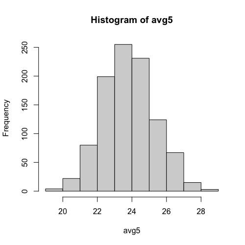
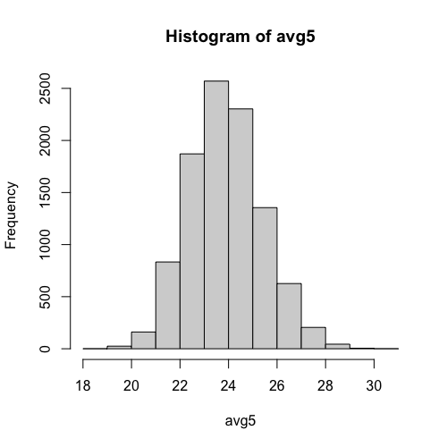

## Null Distributions Exercises

For these exercises, we will be using the following dataset:

```R
library(downloader) 
url <- "https://raw.githubusercontent.com/genomicsclass/dagdata/master/inst/extdata/femaleControlsPopulation.csv"
filename <- basename(url)
download(url, destfile=filename)
x <- unlist( read.csv(filename) )
```

Here `x` represents the weights for the entire population.

### Null Distributions Exercise #1

Set the seed at 1, then using a for-loop take a random sample of 5 mice 1,000 times. Save these averages.

What proportion of these 1,000 averages are more than 1 gram away from the average of `x` ? Proportions are written as numbers between zero and one. **Answer: $0.503$**

```R
set.seed(1)

n <- 1000
avg5 <- vector("numeric", n)
for(i in 1:n){
  X <- sample(x,5)
  avg5[i] <- mean(X)
}

hist(avg5) ## Just to take a look
mean(abs(mean(x)-avg5)>1)
```



### Null Distributions Exercises #2

We are now going to increase the number of times we redo the sample from 1,000 to 10,000. Set the seed at 1, then using a for-loop take a random sample of 5 mice 10,000 times. Save these averages.

What proportion of these 10,000 averages are more than 1 gram away from the average of `x`?**Answer: $0.503$**

```R
set.seed(1)

n <- 10000
avg5 <- vector("numeric", n)
for(i in 1:n){
  X <- sample(x,5)
  avg5[i] <- mean(X)
}

hist(avg5) ## Just to take a look
mean(abs(mean(x)-avg5)>1)
```



