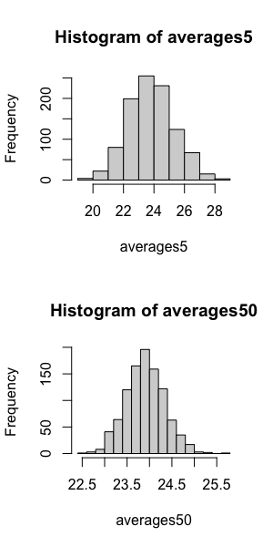

## Normal Distribution Exercises

For these exercises, we will be using the following dataset:

```R
library(downloader) 
url <- "https://raw.githubusercontent.com/genomicsclass/dagdata/master/inst/extdata/femaleControlsPopulation.csv"
filename <- basename(url)
download(url, destfile=filename)
x <- unlist( read.csv(filename) )
```

Here `x` represents the weights for the entire population.

Using the same process as before (in Null Distribution Exercises), set the seed at $1$, then using a for-loop take a random sample of $5$ mice $1,000$ times. Save these averages. After that, set the seed at $1$, then using a for-loop take a random sample of $50$ mice $1,000$ times. Save these averages:

```R
# make averages5
set.seed(1)
n <- 1000
averages5 <- vector("numeric",n)
for(i in 1:n){
  X <- sample(x,5)
  averages5[i] <- mean(X)
}

# make averages50
set.seed(1)
n <- 1000
averages50 <- vector("numeric",n)
for(i in 1:n){
  X <- sample(x,50)
  averages50[i] <- mean(X)
}
```

### Normal Distribution Exercises #1

Use a histogram to "look" at the distribution of averages we get with a sample size of 5 and a sample size of 50. How would you say they differ? **Answer: They both look roughly normal, but with a sample size of 50 the spread is smaller.**

```R
par(mfrow = c(2,1))
hist(averages5)
hist(averages50)

##OR

library(rafalib) 
###mypar(1,2) is optional and is used to put both plots on one page
mypar(1,2)
hist(averages5, xlim=c(18,30))
hist(averages50, xlim=c(18,30))

```



### Normal Distribution Exercises #2

For the last set of averages, the ones obtained from a sample size of $50$, what proportion are between $23$ and $25$? **Answer: 0.982**

```R
sum <- 0
for(i in 1:n){
  if(averages50[i] >= 23 && averages50[i] <= 25)
  sum = sum + 1
}
prop = sum/n

## OR

mean( averages50 < 25 & averages50 > 23)
```

### Normal Distribution Exercises #3

Note that you can use the function `pnorm()` to find the proportion of observations below a cutoff `x` given a normal distribution with mean `mu` and standard deviation `sigma` with `pnorm(x, mu, sigma)` or `pnorm( (x-mu)/sigma )`.

What is the proportion of observations between $23$ and $25$ in a normal distribution with average $23.9$ and standard deviation $0.43$? Hint: Use `pnorm()` twice.

```R
foot <- 23
ceiling <- 25
mu <- 23.9
sigma <- 0.43

prop <- pnorm(ceiling, mu, sigma)-pnorm(foot, mu, sigma)

##OR

pnorm( (25-23.9) / 0.43)  - pnorm( (23-23.9) / 0.43) 
```

The answers to 2 and 3 were very similar. This is because we can approximate the distribution of the sample average with a normal distribution. We will learn more about the reason for this next.