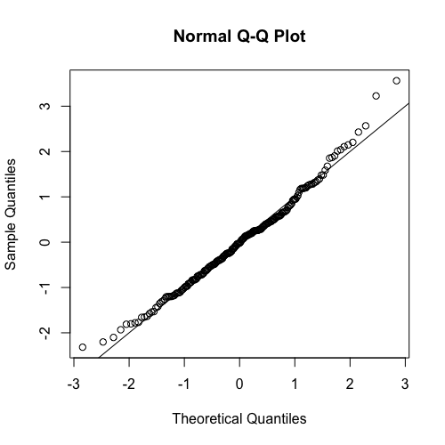
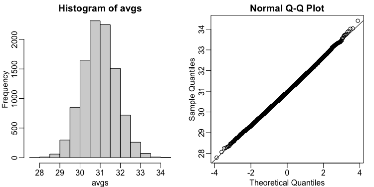

## Central Limit Theorem Exercises

For these exercises, we will be using the following dataset:

```R
library(downloader) 
url <- "https://raw.githubusercontent.com/genomicsclass/dagdata/master/inst/extdata/mice_pheno.csv"
filename <- basename(url)
download(url, destfile=filename)
dat <- na.omit( read.csv(filename) )
```

### Central Limit Theorem Exercises #1

If a list of numbers has a distribution that is well approximated by the normal distribution, what proportion of these numbers are within one standard deviation away from the list's average?. (Hint: Use the `pnorm()` function. You can look up more information with `?pnorm`.) **Answer: 0.6826895**

```R
pnorm(1)-pnorm(-1)
```

### Central Limit Theorem Exercises #2

What proportion of these numbers are within two standard deviations away from the list's average? **Answer: $0.9544997$**

```R
pnorm(2)-pnorm(-2)
```

### Central Limit Theorem Exercises #3

What proportion of these numbers are within three standard deviations away from the list's average? **Answer: $0.9973002$**

```R
pnorm(3)-pnorm(-3)
```

### Central Limit Theorem Exercises #4

Define $y$ to be the weights of males on the control diet. What proportion of the mice are within one standard deviation away from the average weight? (Hint: Remember to use `popsd()` from `**rafalib**` for the population standard deviation.) **Answer: 0.6950673**

```R
library(rafalib)
y <- filter(dat, Sex="M", Diet="chow") %>%
     select(Bodyweight) %>%
     unlist()
y_mean <- mean(y)
y_popsd <- popsd(y)
mean((y > (y_mean - y_popsd)) & (y < (y_mean + y_popsd)))

## OR

y <- filter(dat, Sex=="M" & Diet=="chow") %>% select(Bodyweight) %>% unlist
z <- ( y - mean(y) ) / popsd(y)
mean( abs(z) <=1 )
```

### Central Limit Theorem Exercises #5

What proportion of these numbers are within three standard deviations away from the list's average? **Answer: $0.9461883$**

```R
mean( abs(z) <=2)
```

### Central Limit Theorem Exercises #6

What proportion of these numbers are within three standard deviations away from the list's average? **Answer: $0.9910314$**

```R
mean( abs(z) <=3)
```

### Central Limit Theorem Exercises #7
Note that the numbers for the normal distribution and our weights are relatively close. Also, notice that we are indirectly comparing quantiles of the normal distribution to quantiles of the mouse weight distribution. We can actually compare all quantiles using a qqplot.

```R
qqnorm(z)
abline(0,1)
```



Which of the following best describes the qq-plot comparing mouse weights to the normal distribution? **Answer: The mouse weights are well approximated by the normal distribution, although the larger values (right tail) are larger than predicted by the normal. This is consistent with the differences seen between question 3 and 6.**

### Central Limit Theorem Exercises #8

Here we are going to use the function `replicate()` to learn about the distribution of random variables. All the above exercises relate to the normal distribution as an approximation of the distribution of a fixed list of numbers or a population. We have not yet discussed probability in these exercises. If the distribution of a list of numbers is approximately normal, then if we pick a number at random from this distribution, it will follow a normal distribution. However, it is important to remember that stating that some quantity has a distribution does not necessarily imply this quantity is random. Also, keep in mind that this is not related to the central limit theorem. The central limit applies to averages of random variables. Let's explore this concept.

We will now take a sample of size $25$ from the population of males on the chow diet. The average of this sample is our random variable. We will use the `replicate()` function to observe $10,000$ realizations of this random variable. Set the seed at $1$, then generate these $10,000$ averages. Make a histogram and qq-plot of these $10,000$ numbers against the normal distribution.

We can see that, as predicted by the CLT, the distribution of the random variable is very well approximated by the normal distribution.

```R
y <- filter(dat, Sex=="M" & Diet=="chow") %>% select(Bodyweight) %>% unlist
set.seed(1)
avgs <- replicate(10000, mean( sample(y, 25)))
mypar(1,2)
hist(avgs)
qqnorm(avgs)
qqline(avgs)
```



What is the average of the distribution of the sample average? **Answer: $30.96856$**

```R
mean(avgs)
```

### Central Limit Theorem Exercises #9

What is the standard deviation of the distribution of sample averages (use `popsd()`)? **Answer: $0.827082$**

```R
popsd(avgs)
```

