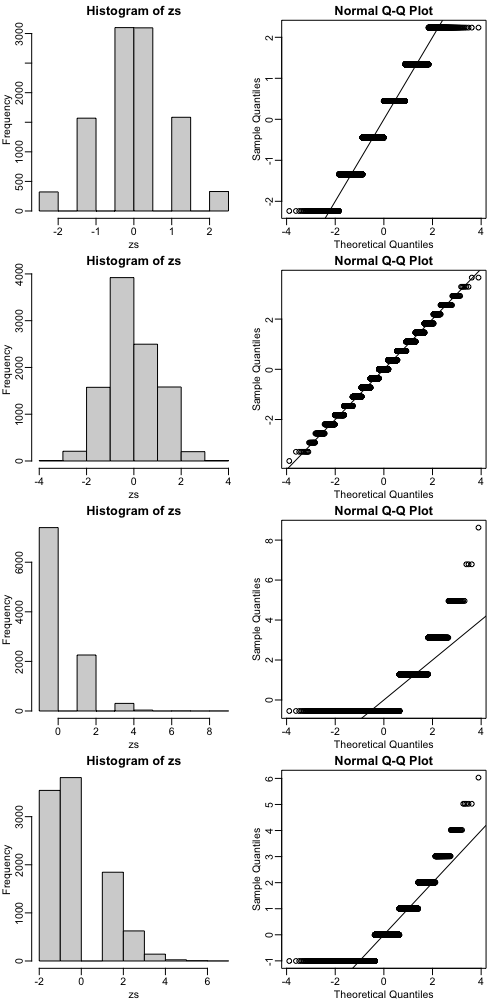

## CLT and t-distribution in Practice Exercises

Exercises 3-13 use the mouse data set we have previously downloaded:

```R
library(downloader)
url <- "https://raw.githubusercontent.com/genomicsclass/dagdata/master/inst/extdata/femaleMiceWeights.csv"
filename <- "femaleMiceWeights.csv"
if(!file.exists("femaleMiceWeights.csv")) download(url,destfile=filename)
dat <- read.csv(filename)
```

### CLT and t-distribution in Practice Exercises #1

The CLT is a result from probability theory. Much of probability theory was originally inspired by gambling. This theory is still used in practice by casinos. For example, they can estimate how many people need to play slots for there to be a $99.9999\%$ probability of earning enough money to cover expenses. Let's try a simple example related to gambling.

Suppose we are interested in the proportion of times we see a $6$ when rolling `n=100` dice. This is a random variable which we can simulate with `x=sample(1:6, n, replace=TRUE)` and the proportion we are interested in can be expressed as an average: `mean(x==6)`. Because the dice rolls are independent, the CLT applies.

We want to roll `n` dice $10,000$ times and keep these proportions. This random variable (proportion of $6$s) has mean `p=1/6` and variance `p*(1-p)/n`. So according to the CLT, `z = (mean(x==6) - p) / sqrt(p*(1-p)/n)` should be normal with mean $0$ and SD $1$.

Set the seed to $1$, then use `replicate()` to perform the simulation, and report what proportion of times `z` was larger than $2$ in absolute value (CLT says it should be about $0.05$).

**Answer: $0.0422$**

```R
set.seed(1)
n <- 100
p <- 1/6
x <- replicate(10000, mean(sample(1:6, n, replace=TRUE)==6))
z <- (x - p) / sqrt(p*(1-p)/n)
solution <- mean(abs(z) > 2)

## OR

set.seed(1)
n <- 100
sides <- 6
p <- 1/sides
zs <- replicate(10000,{
  x <- sample(1:sides,n,replace=TRUE)
  (mean(x==6) - p) / sqrt(p*(1-p)/n)
}) 
qqnorm(zs)
abline(0,1)#confirm it's well approximated with normal distribution
mean(abs(zs) > 2)
```

### CLT and t-distribution in Practice Exercises #2

For the last simulation you can make a qqplot to confirm the normal approximation. Now, the CLT is an asymptotic result, meaning it is closer and closer to being a perfect approximation as the sample size increases. In practice, however, we need to decide if it is appropriate for actual sample sizes. Is 10 enough? 15? 30?

In the example used in exercise 1, the original data is binary (either 6 or not). In this case, the success probability also affects the appropriateness of the CLT. With very low probabilities, we need larger sample sizes for the CLT to "kick in".

Run the simulation from exercise 1, but for different values of p and n. For which of the following is the normal approximation best?

* `p=0.5` and `n=5`
* `p=0.5` and `n=30`
* `p=0.01` and `n=30`
* `p=0.01` and `n=100`

**Answer: `p=0.5` and `n=30`**

```R
ps <- c(0.5,0.5,0.01,0.01)
ns <- c(5,30,30,100)
library(rafalib)
mypar(4,2)
for(i in 1:4){
  p <- ps[i]
  sides <- 1/p
  n <- ns[i]
  zs <- replicate(10000,{
  	x <- sample(1:sides,n,replace=TRUE)
  	(mean(x==1) - p) / sqrt(p*(1-p)/n)
  }) 
  hist(zs,nclass=7)
  qqnorm(zs)
  abline(0,1)
}
```



### CLT and t-distribution in Practice Exercises #3

As we have already seen, the CLT also applies to averages of quantitative data. A major difference with binary data, for which we know the variance is $p(1-p)$, is that with quantitative data we need to estimate the population standard deviation.

In several previous exercises we have illustrated statistical concepts with the unrealistic situation of having access to the entire population. In practice, we do *not* have access to entire populations. Instead, we obtain one random sample and need to reach conclusions analyzing that data. `dat` is an example of a typical simple dataset representing just one sample. We have 12 measurements for each of two populations:

```R
X <- filter(dat, Diet=="chow") %>% select(Bodyweight) %>% unlist
Y <- filter(dat, Diet=="hf") %>% select(Bodyweight) %>% unlist
```

We think of $X$ as a random sample from the population of all mice in the control diet and $Y$ as a random sample from the population of all mice in the high fat diet.

Define the parameter $\mu_X$ as the average of the control population. We estimate this parameter with the sample average $\bar{X}$. What is the sample average? 

**Answer: $23.81333$**

```R
mean(X)
```

### CLT and t-distribution in Practice Exercises #4

We don't know $\mu_X$, but want to use $\bar{X}$ to understand it. Which of the following uses CLT to understand how well $\bar{X}$ approximates $\mu_X$? [^1]

* $\bar{X}$ follows a normal distribution with mean 0 and standard deviation 1.
* $\mu_X$ follows a normal distribution with mean $\bar{X}$ and standard deviation $\sigma_X \over \sqrt{12}$ where $\sigma_X$ is the population standard deviation.
* $\bar{X}$ follows a normal distribution with mean $\mu_X$ and standard deviation $\sigma_X$ where $\sigma_X$ is the population standard deviation.
* $\bar{X}$ follows a normal distribution with mean $\mu_X$ and standard deviation $\sigma_X \over \sqrt{12}$ where $\sigma_X$ is the population standard deviation.

[^1]:**Remember!** The S.E.M. (Standard Error of the Mean) is the standard deviation of the distribution of sample means: $SEM = {\sigma_X \over \sqrt{n}}$

**Answer: $\bar{X}$ follows a normal distribution with mean $\mu_X$ and standard deviation $\sigma_X \over \sqrt{12}$ where $\sigma_X$ is the population standard deviation.**

### CLT and t-distribution in Practice Exercises #5

The result above tells us the distribution of the following random variable: $ Z = \sqrt{12}{\bar{X}-\mu_X \over \sigma_X} $. What does the CLT tell us is the mean of $Z$ (you don't need code)?

**Answer: 0** (Because the mean of $\bar{X}-\mu_X$ is zero.)

### CLT and t-distribution in Practice Exercises #6

The result of 4 and 5 tell us that we know the distribution of the difference between our estimate and what we want to estimate, but don't know. However, the equation involves the population standard deviation $\sigma_X$, which we don't know.

Given what we discussed, what is your estimate of $\sigma_X$?

Hint: While the `popsd()` function from `**rafalib**` calculates population standard deviations, the `sd()` function in base R calculates sample standard deviations.

**Answer: $3.022541$**

```R
sd(X)
```

#### Comments on this exercise

Here's a breakdown of why `sd(X)` is the appropriate estimate:

1.  **The Problem:** The Central Limit Theorem (CLT) is fantastic because it tells us about the distribution of $\bar{X}$ (and the Z-score) using $\mu_X$ and $\sigma_X$. However, in most real-world scenarios, we *don't know* the population parameters $\mu_X$ and $\sigma_X$. If we knew them, there would often be no need to sample in the first place!

2.  **Estimation:** Since we don't know $\sigma_X$, we have to *estimate* it from the data we *do* have, which is our sample.

3.  **Sample Standard Deviation (`sd(X)` in R):**
    * The `sd()` function in R (and similar functions in other statistical software) calculates the **sample standard deviation**.
    * The formula for the sample standard deviation is:
        $s = \sqrt{\frac{\sum_{i=1}^{n} (x_i - \bar{x})^2}{n-1}}$
    * Notice the $n-1$ in the denominator. This is known as **Bessel's correction**.

4.  **Why $n-1$ (Bessel's Correction)?**
    This is the key reason why the sample standard deviation is the correct estimate for the population standard deviation when you only have a sample:
    * **Bias:** If you were to calculate the standard deviation using $n$ in the denominator (like the `popsd()` function or if you had the *entire* population), it would tend to **underestimate** the true population standard deviation. This is because the sample data points are naturally closer to their *sample mean* ($\bar{x}$) than they are to the *true population mean* ($\mu_X$, which is unknown).
    * **Unbiased Estimator:** By dividing by $n-1$, the sample standard deviation $s$ becomes an **unbiased estimator** of the population standard deviation $\sigma_X$. This means that if you were to take many, many samples and calculate $s$ for each, the average of all those $s$ values would be a good approximation of the true $\sigma_X$.

5.  **`popsd()` vs. `sd()`:**
    * The `popsd()` function (from `rafalib` or similar custom functions) calculates the standard deviation assuming the data you have *is* the entire population (i.e., using $n$ in the denominator). This is rarely the case in inferential statistics.
    * The `sd()` function (base R) correctly assumes your data is a *sample* from a larger population and uses $n-1$ to provide an unbiased estimate of that larger population's standard deviation.

### CLT and t-distribution in Practice Exercises #7

Use the CLT to approximate the probability that our estimate $\bar{X}$ is off by more than 2 grams from $\sigma_X$.

**Answer: $0.02189533$**

```R
s_x <- sd(X)
n <- length(X)
sem <- s_x / sqrt(n)
z <- 2 / sem
2 * pnorm(-z)

## OR

2 * ( 1-pnorm(2/sd(X) * sqrt(12) ) )
```

### CLT and t-distribution in Practice Exercises #8

Now we introduce the concept of a null hypothesis. We don't know $\mu_X$ nor $\mu_Y$. We want to quantify what the data say about the possibility that the diet has no effect: $\mu_X = \mu_Y$. If we use CLT, then we approximate the distribution of $\bar{X}$ as normal with mean $\mu_X$ and standard deviation $\sigma_X / \sqrt{M}$ and the distribution of $\bar{Y}$ as normal with mean $\mu_Y$ and standard deviation $\sigma_Y / \sqrt{N}$, with $M$ and $N$ the sample sizes for $X$ and $Y$ respectively, in this case $12$. This implies that the difference $\bar{Y} - \bar{X}$ has mean $0$. We described that the standard deviation of this statistic (the standard error) is $\text{SE}( \bar{X}-\bar{Y}) = \sqrt{ \sigma_Y^2 / 12 + \sigma_X^2 /12 }$ and that we estimate the population standard deviations $\sigma_X$ and $\sigma_Y$ with the sample estimates.

What is the estimate of $\text{SE}( \bar{X}-\bar{Y}) = \sqrt{ \sigma_Y^2 / 12 + \sigma_X^2 /12 }$?

**Answer: $1.469867$**

```R
sqrt( sd(X)^2/12 + sd(Y)^2/12 )
## OR sqrt( var(X)/12 + var(Y)/12)
```

### CLT and t-distribution in Practice Exercises #9

So now we can compute $\bar{Y}-\bar{X}$ as well as an estimate of this standard error and construct a t-statistic. What number is this t-statistic?

**Answer: $2.055174$**

```R
( mean(Y) - mean(X) ) / sqrt( var(X)/12 + var(Y)/12)
## OR 
t.test(Y,X)$stat
```

### CLT and t-distribution in Practice Exercises #10

For some of the following exercises you need to review the t-distribution that was discussed in the lecture. If you have not done so already, you should review the related book chapters from our textbook on the [CLT and t-distribution](http://genomicsclass.github.io/book/pages/clt_and_t-distribution.html) and [t-tests in practice](http://genomicsclass.github.io/book/pages/t-tests_in_practice.html).

In particular, you will need to remember that the t-distribution is centered at 0 and has one parameter: the degrees of freedom, that control the size of the tails. You will notice that if X follows a t-distribution the probability that X is smaller than an extreme value such as 3 SDs away from the mean grows with the degrees of freedom. For example, notice the difference between:

```R
1 - pt(3,df=3)
1 - pt(3,df=15)
1 - pt(3,df=30)
1 - pnorm(3)
```

As we explained, under certain assumptions, the t-statistic follows a t-distribution. Determining the degrees of freedom can sometimes be cumbersome, but the t.test function calculates it for you. One important fact to keep in mind is that the degrees of freedom are directly related to the sample size. There are various resources for learning more about degrees of freedom on the internet as well as statistics books.

If we apply the CLT, what is the distribution of this t-statistic?

* Normal with mean 0 and standard deviation 1.
* t-distributed with 22 degrees of freedom.
* Normal with mean 0 and standard deviation $\sqrt{\sigma_Y^2/12 + \sigma_X^2/12}$.
* t-distributed with 12 degrees of freedom.

**Answer: Normal with mean 0 and standard deviation 1.**

### CLT and t-distribution in Practice Exercises #11
Now we are ready to compute a p-value using the CLT. What is the probability of observing a quantity as large as what we computed in 9, when the null distribution is true?

**Answer: $0.0398622$**

```R
Z <- ( mean(Y) - mean(X) ) / sqrt( var(X)/12 + var(Y)/12)
2*( 1-pnorm(Z)) 
```

### CLT and t-distribution in Practice Exercises #12

CLT provides an approximation for cases in which the sample size is large. In practice, we can't check the assumption because we only get to see 1 outcome (which you computed above). As a result, if this approximation is off, so is our p-value. As described earlier, there is another approach that does not require a large sample size, but rather that the distribution of the population is approximately normal. We don't get to see this distribution so it is again an assumption, although we can look at the distribution of the sample with `qqnorm(X)` and `qqnorm(Y)`. If we are willing to assume this, then it follows that the t-statistic follows the t-distribution.

What is the p-value under the t-distribution approximation?
Hint: use the t.test() function.


```bash
git add .
git commin -m "..."
git push origin main
```
